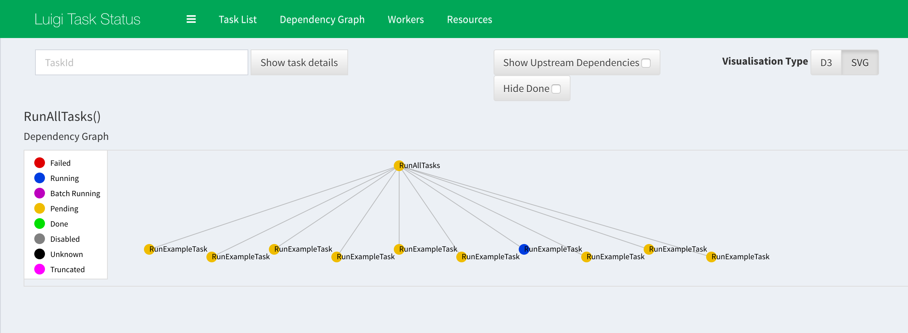

# Luigi with Docker

```
______██████████████
-____██▓▓▓▓▓▓▓▓▓ L ▓████
-__██▓▓▓▓▓▓▓▓▓▓▓▓▓▓▓▓▓▓██
-__██████░░░░██░░██████
██░░░░████░░██░░░░░░░░██
██░░░░████░░░░██░░░░░░██
-__████░░░░░░██████████
-__██░░░░░░░░░░░░░██
_____██░░░░░░░░░██
-______██░░░░░░██
-____██▓▓████▓▓▓█
-_██▓▓▓▓▓▓████▓▓█
██▓▓▓▓▓▓███░░███░
-__██░░░░░░███████
-____██░░░░███████
-______██████████
-_____██▓▓▓▓▓▓▓▓▓██
-_____█████████████

A tool for creating a Luigi docker development and production environment with a single
scheduler and workers. 
```

## Setup

Before starting the cluster you will need to install docker
(docker-engine >= 0.10.0) and docker-compose. If you already have these
installed, you can skip to [Getting Started](#getting-started).

Luigi is set to version 2.4.0 using Python 3.5.2.

### Setting up Docker

You can install docker from [here](https://docs.docker.com/engine/installation/).

## Getting Started

With docker installed, the simplest way to get the luigi cluster
up and running is to run the setup command. The setup command will
launch a scheduler and a worker node with a single postgres instance to
record task history. You can run the command by entering the following
in your shell:

```
./luigi setup
```

You should see a success message if the setup command ran successfully. To
check and see if the docker containers are running, run the following

```
docker ps --filter "name=luigi"
```

There should be three containers running where the names will be prefixed with
`luigi_`.

At this point, try navigating to `http://localhost:8082` in your browser. If
the scheduler is up you should be able to see the luigi visualizer. This
is a handy web ui that helps you see what tasks are pending, running, failed,
etc.

At this point, you can start interacting with the cluster!

### Running Tasks

The cluster will currently be running in a docker network (defaults to
luigi_default), which means the easiest way of interacting with it
is to attach a luigi worker container to the network. The best way is to run
the `shell` command which will drop you into the shell of a development worker
container.

```
./luigi shell
```

From here, we can start running Luigi tasks.

In the `src/tasks` package, there is an example task that we will run to see how
the worker connects with the scheduler. This example task will dynamically
run 10 tasks that will sleep for 0 to 9 seconds and then write a file to
a local `tmp/` directory.

First, make sure you are watching the visualizer in your browser
(go to `http://localhost:8082`). Then, let's run the following in the luigi
shell:

```
luigi@worker/luigi$ python -m src.tasks.example RunAllTasks
```

You should see a bunch of messages where tasks are being checked `completed` and then
being set to `pending`. Now, take a look at the visualizer and open the graph
for `RunAllTasks`. You should see a screen similar to the following:



You can click on the nodes to see more detailed information about the tasks
and their status. Once all the tasks are green, check out the `tmp/` directory

```
luigi@worker/luigi$ ls tmp/
```

You should see 11 .txt files which are the finished output of each task!


### Luigi Config File

The docker container contains a python script `/generate_config.py` that will
generate a luigi config file from environment variables. The config file
will be generated and set to the path given by the env `LUIGI_CONFIG_PATH`
(defaults to `/etc/luigi/luigi.cfg`).

Environment variables to be written should follow this standard:

```
    LUIGI_<section>_<key>=<value>
```

eg.
```
    LUIGI_CORE_DEFAULT-SCHEDULER-URL=http://localhost:8082
        ->
            [core]
            default-scheduler-url=http://localhost:8082

    LUIGI_WORKER_PING_INTERNAL=1.0
        ->
            [worker]
            ping_internal=1.0
```

**NB:** Luigi config files contain a mix between hyphens and underscores in
their config file. You need to ensure the name of the config key contains
the proper hyphens or underscores. For example,
`LUIGI_CORE_DEFAULT-SCHEDULER-URL` contains hyphens in the key whereas 
`LUIGI_WORKER_PING_INTERNAL` does not. If you mix them, they will not be
recognized by the luigi config parser! Always double check the values in the
[documentation](http://luigi.readthedocs.io/en/stable/configuration.html).


## Cluster Ops

```
./luigi up
```
Starts up the cluster with a default single scheduler, worker, and postgres instance.

```
./luigi down
```
Stops the cluster then removes the stopped containers.

```
./luigi stop
```
Stop the cluster.

## Debugging

Displays the cluster logs.
```
./luigi logs <optional: docker-compose service name>
```
Or follow them with:
```
./luigi logs -f <optional: docker-compose service name>
```
